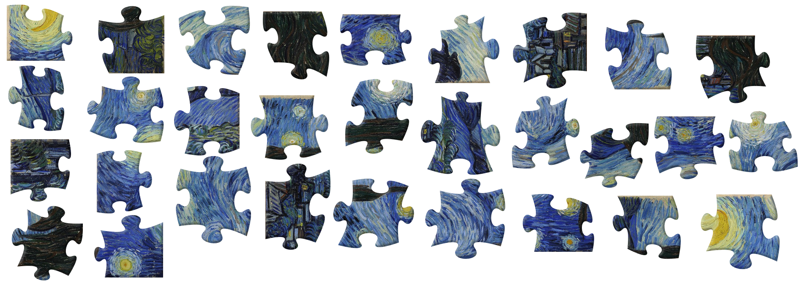
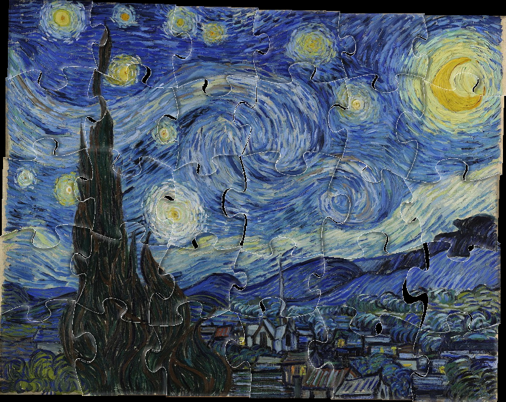
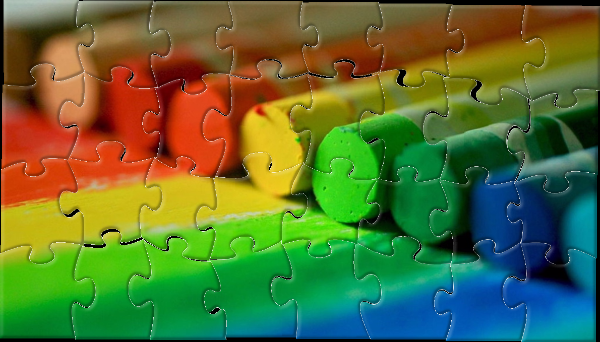
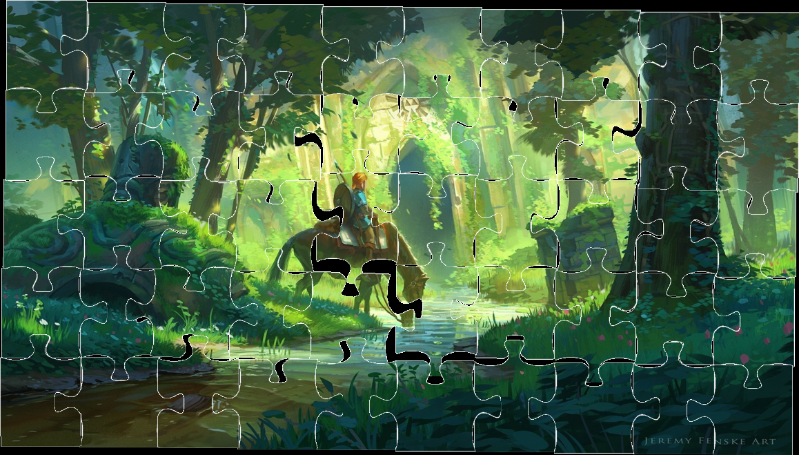

# Zolver

Zolver is a jigsaw puzzle solver written in python. This project is an end-of-studies project
developed by 4 EPITA students. It aims to solve computer generated and real jigsaw puzzles.

A short video presentation is available [here](https://www.youtube.com/watch?v=Oq36FtMg0-k)

A jigsaw puzzle

Zolver reconstruction

## Requirements

- numpy>=1.11.0
- scipy==1.0.0
- opencv_python==3.3.0.10
- scikit_image==0.13.1
- matplotlib==2.1.0
- Pillow
- PyQt5>=5.0
- skimage
- scikit_learn>=0.18.1

## Usage
### With GUI
Use `python3 main.py`

### Without GUI
Use `python3 main_no_gui.py path/to/image`

## Zolver overview

### Preprocessing

First, we apply a binary threshold to our image. The threshold is different if we process
a real puzzle or a real one. We then apply some mathematical morphologies to link edges
in case some edges have holes. We last apply OpenCV contour detection.

### Edge classification

We now need to find the four edges of each puzzle piece. To do so, we compute the relative angle
between adjacent points and we get local extrema. Once our edges have been splitted, we classify
our edges into three categories: frame edge, indent padding edge and outdent padding edge by
recognizing patterns with relative angle curves.

### Edge matching

We use three different ways to match edges :
- Comparing the edges size to only compare edges with similar length.
- Using color to match edges. For every pixel on the edge, we take the median color of
its neighboring pixels and we then compare the distance to the other edge pixel to pixel.
- Comparing shapes using a Euclidian distance along the edges.

### Puzzle Solving

We first solve the puzzle edge because once we have its frame, every puzzle piece can be matched
using at least two edges. The more edges we have to check how likely is the piece to match, the less
Zolver is likely to make an error. Zolver will always try to fill the empty space with the highest
number of edges already filled.

## Authors
SCIA 2018 - EPITA

* Cyril Cetre
* Denis Castéran
* Jérémy Lugand
* Hugo Rybinski

